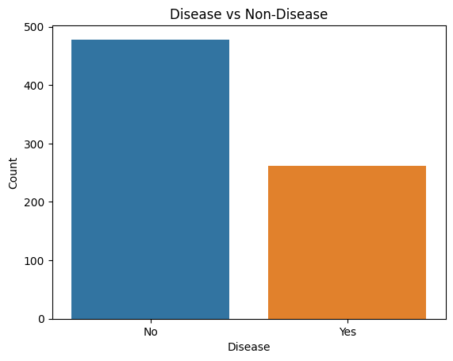
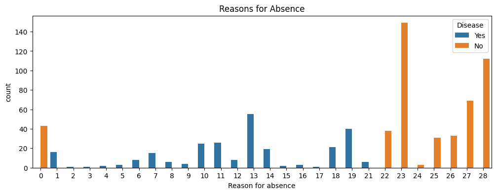
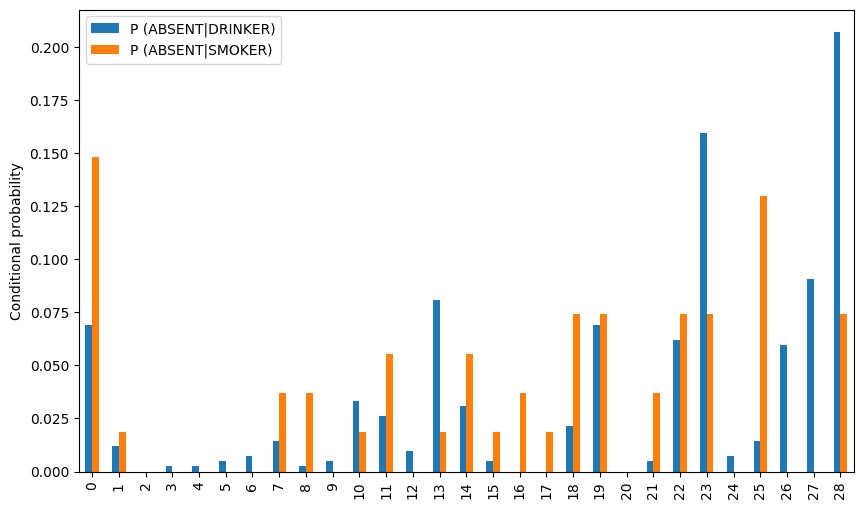
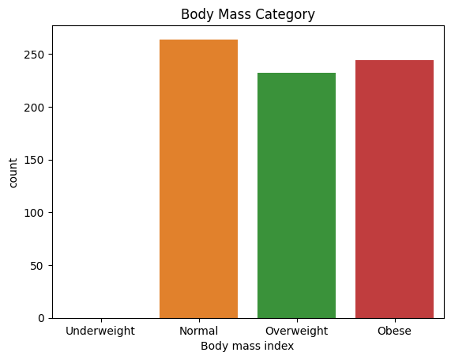
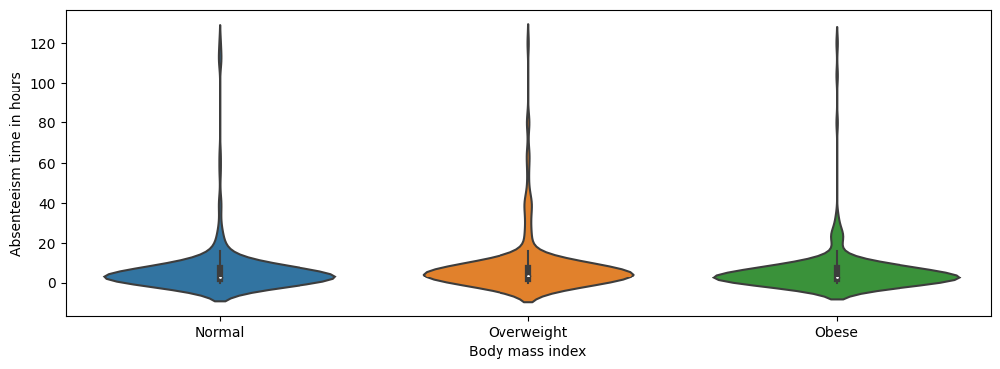
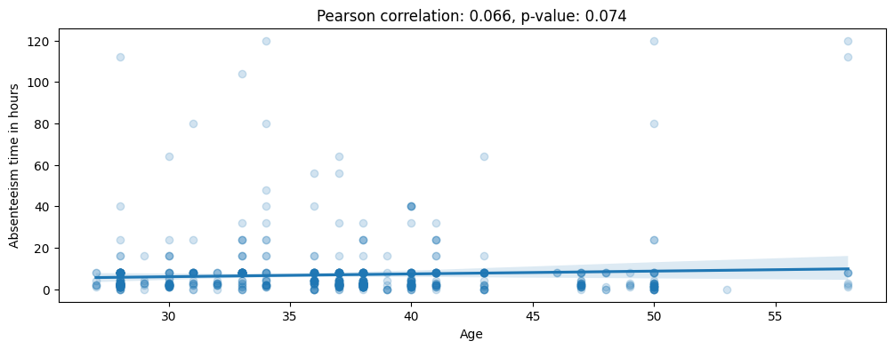

# Absenteeism at Work Analysis

This project aims to analyze absenteeism at work using a dataset that includes various features related to employee absenteeism. The project utilizes Python and popular data analysis libraries to explore, visualize, and draw insights from the data.

## Table of Contents
- [Getting Started](#getting-started)
- [Dataset](#dataset)
- [Analysis Steps](#analysis-steps)
- [Results and Insights](#results-and-insights)

## Getting Started

To get started with the analysis, you'll need to install the necessary Python libraries. You can install these libraries using pip:

```bash
pip install pandas numpy matplotlib seaborn scipy
```

## Dataset

The dataset used for this analysis is titled "Absenteeism at Work" and is stored in a CSV file named "Absenteeism_at_work.csv." It contains information on various factors related to employee absenteeism, such as reasons for absence, transportation expenses, distance from residence to work, education level, and more.

## Analysis Steps

### 1. Importing the Libraries and the Dataset

In this step, the required libraries are imported, and the dataset is loaded into a pandas DataFrame for analysis.

### 2. Data Preprocessing

The dataset is cleaned and preprocessed by encoding categorical variables, transforming features, and handling missing values.

### 3. Exploratory Data Analysis (EDA)

EDA is conducted to explore the dataset and understand the relationships between different variables. Visualizations and statistical tests are used to gain insights.

### 4. Absenteeism Analysis

The analysis includes exploring factors affecting absenteeism, such as social drinking and smoking habits, body mass index (BMI), age, education, and transportation costs. Statistical tests are performed to identify significant correlations and differences.

### 5. Temporal Analysis

Temporal factors, such as the day of the week and the month of absence, are analyzed to determine if there are patterns related to absenteeism.

## Results and Insights

The project provides various insights into the factors affecting absenteeism at work, including social habits, education level, transportation costs, and temporal patterns. Statistical tests and visualizations aid in understanding these relationships.



As we can see, the number of reasons for absence that are not listed in the ICD table is almost twice the number of listed ones.

## Reason for Absence


The most common reason for absence is "Diseases of the musculoskeletal system and connective tissue," followed by "Injury, poisoning, and certain other consequences of external causes."

The least common reason for absence is "Pregnancy, childbirth, and the puerperium," followed by "Certain conditions originating in the perinatal period."

Proportion of Social Drinker: 56.76%
Proportion of Social Smoker: 7.30%

## Social Habits


As we can observe from the previous plot, the highest reason for absence for drinkers is dental consultations (28), followed by medical consultations (23). Smokers' absences, however, are mostly due to unknown reasons (0) and laboratory examinations (25).

## Body Mass Index (BMI)


The average BMI of the employees is 26.68, which is considered overweight. We can see that no entries for the underweight category are present, with the data being almost uniformly distributed among the remaining three categories. Of course, this is an alarming indicator, as more than 60% of the employees are either overweight or obese.



No evidence states that BMI and obesity levels influence the employees' absenteeism.

## Age


The average age of the employees is 36.45 years, with the youngest employee being 27 years old and the oldest being 58 years old. As we can observe from the resulting plot, no significant pattern occurs. Furthermore, the correlation coefficient is extremely small (0.066), and its p-value is above the threshold of 0.05, which is an additional indicator that no relationship is present between the Age and Absenteeism time in hours features.

## Education
The majority of the employees have a high school education (611), followed by a graduate degree (273). The least common education level is a master's degree (14), followed by a doctorate (10).

## Transportation Expense
The average transportation expense is 221.03, with the lowest being 118 and the highest being 388. The majority of the employees have a transportation expense of 179, followed by 225.

## Distance to Work
The average distance to work is 29.63 km, with the lowest being 5 and the highest being 52. The majority of the employees have a distance to work of 26 km, followed by 51 km.
